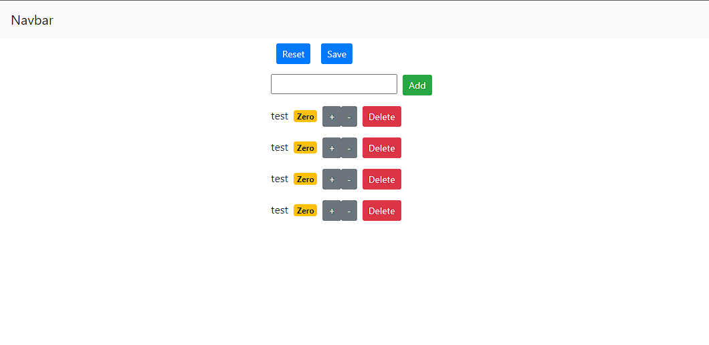

# ShoppingList

A webpage based online shopping list, this was made 4 years ago back when we still used class components a lot. Can't say I miss them.

My idea is to give this project a revamp.

## This is how it used to look

### Notible featback

- It's not really clear that this would be a shopping list.
- After a refresh, the content is reset to its original state.
- Not really responsive for either Desktop or Mobile.
- Styling could do with a make-over.

## To do's & Ideas

- [ ] Move to Next.js because SSR is awesome
- [ ] Restyle page using shadcn/ui and tailwind
- [ ] Use cookies to store list of items

### Nice to haves

- [ ] Add suggested recepies to add ingredients to shopping list
- [ ] Instead of cookies, use a small db to store shopping list
- [ ] Crud system to add your own recepies
